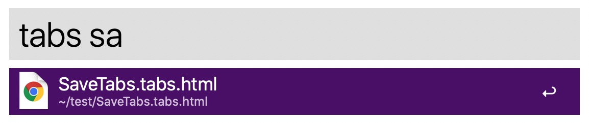

## Chrome-Workspace

A alfred workflow for the chrome extension of [savetabs](https://github.com/hzh-cocong/SaveTabs).

It can search the file like ***\*.tabs.html*** and create a new chrome browser window to open it.

It works like a workspace, so I named it a ***Chrome Workspace***.

## How to use?

Just input the keyword with ***tabs*** prefix like below.

## What is the ***\*.tabs.html***?

It is generate by a chrome extension that can save browser tab's url as a file so that you can open it again just like a workspace. 

More details please click [here](https://github.com/hzh-cocong/SaveTabs).

## Supported version for Alfred

***>= 4.0.0***

I created it by the Alfred 4. 

The version below 4 may cannot work.

## Download

You can download from [Packal](http://www.packal.org/workflow/chrome-workspace) or click [here](https://github.com/hzh-cocong/Time-Helper/releases/download/v1.0.0/Chrome.Workspace.alfredworkflow)

